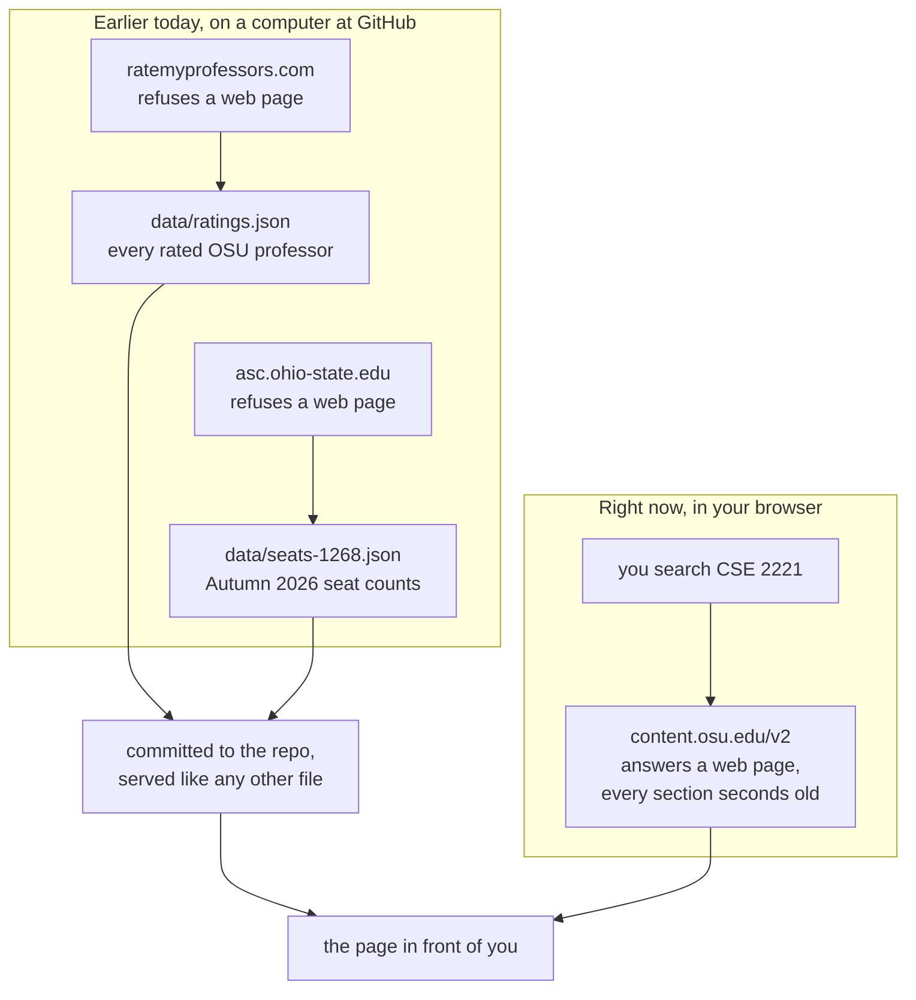
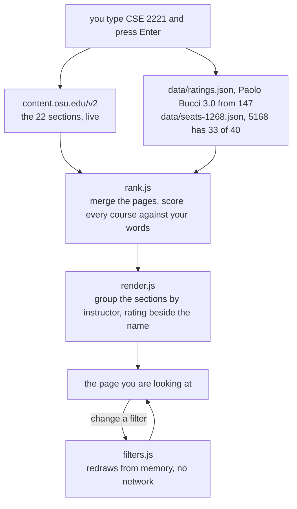

# Finder

Find who teaches your classes before everyone else.

**Live: https://enesyilmazcode.github.io/Finder/**

Ohio State's class search will confirm that CSE 2221 exists. It will not
tell you which of its sections still has a seat, or which instructor people
warn you about. Finder answers both. Search a course and you get every
section grouped by instructor, with a rating next to each name and real
seat counts where they exist.

---

## Why this exists

[osucoursesearch.org](https://osucoursesearch.org) did roughly this job and
went down. Its database stopped answering and its author moved on, so the
site now returns a Django error page instead of course data.

Finder has no server and no database behind its search, so there is no
equivalent piece to fail. It is a folder of files on GitHub Pages.

## What you see


- **Filters.** Days, time window, busy times, minimum rating, rated only, hide full,
  hide online, hide permission-only, undergraduate only. A sort control sits above them.
- **Middle.** The same sections as a list by instructor, or on a week grid.
- **Right pane.** Rating, difficulty, take-again, seats, room, description.

The grid is the same sections placed by when they meet, and whichever one you
picked stays open beside it.


On a phone the filters move behind a Filters button and the right pane takes
over the screen, so you get the same three panes one at a time.


No filter touches the network, and nothing a filter hides vanishes quietly:
the page says how many sections it removed and offers a button that shows
them anyway. A separate Schedule view lets you keep sections from different
searches, see them together on the week grid and catch conflicts before you
register. Linked labs and recitations come with their section; when several are
valid, Finder asks which one instead of guessing. The schedule stays in this
browser unless you choose Share.

Every search is in the address bar, and so is the section you picked, so a
link opens on the section you meant rather than on the search. The right
pane copies the class number BuckeyeLink asks for, and offers Share on the
browsers that have it.

## Where the data comes from



`data/ratings-courses.json` rides along with the ratings, and
`data/courses.json` is rebuilt the same way once a week.

Only the saved files can go stale, which is why the page prints the date
the seat counts came from.

The split is not a preference. A website can refuse to be read by a page
from another website, and RateMyProfessors and Barrett's schedule both do.
The Ohio State address in that picture does not. It sends one header,
`Access-Control-Allow-Origin: *`, which is standing permission for any page
to read it. That header is why Finder can exist with no server.

### OSU's API reports enrollment wrong per section

OSU's class API returns one enrollment number per course and stamps it onto
every section. It publishes no per-section enrollment cap at all. For
CSE 2221 in Autumn 2026 it calls all 22 sections open. 12 of them are full.
Class 4831 is 41 people in a 40-seat room with two waiting, still listed
open.

Seats come from Barrett's schedule instead, a fixed-width text file that
`asc.ohio-state.edu` rebuilds once a day around 06:50 Eastern. Barrett
lists fewer sections than the API, 407 of Autumn 2026's 1,064 CSE sections
when I checked on August 20, so some rows show no seat numbers. That beats
printing a zero nobody checked.

### Most instructors are not on RateMyProfessors

About 36% are, measured across 757 instructors in 8 subjects for Autumn
2026. Unrated is the ordinary case, so it costs nothing on screen. Every
name is a link either way, to a profile when there is a match and to a
RateMyProfessors search when there is not. Matching drops middle names and
suffixes, so OSU's "Diana Ikenberry Kline" finds RateMyProfessors' "Diana
Kline". When two professors share a first and last name the lookup returns
nothing rather than picking one, because a wrong rating is worse than no
rating.

### An average hides two things a student needs

A 3.0 can be a pile of threes or two camps that never met, and it can be
earned in a course nobody on screen is taking. The detail pane draws the
five per-score counts as a bar, and says how many of the ratings name the
course you are looking at. Paolo Bucci, pulled on August 21: his 3.0 is
32 ones and 38 fives, and 52 of his 147 ratings are for CSE 2221.

Those course names are free text raters typed, so "CSE 2221", "cse2221",
"CS2221" and "COMPUTERSCIENCE2221" all count, and so does a bare "2221"
unless the same professor also wrote that number under another subject, in
which case it is too ambiguous to give to either. The pre-semester CSE 321
never counts, because nothing says the old number is the new course. OSU
writes 23% of its catalog as "1110.01", which no rater types, so those
match on the 1110 and the line says 1110 back.

The counts live in `data/ratings-courses.json`, 151 KB gzipped and read
only by the detail pane, so it is fetched when you open the first section
rather than when the page loads.

### What the registrar recorded, next to what students said

A rating is what people felt. `data/grades.json` is what Ohio State wrote
down: five academic years of per-section grade distributions, Autumn 2021
through Spring 2026, obtained under Ohio's public records law because OSU
publishes nothing like it. `scripts/fetch-grades.mjs` folds that spreadsheet
into one curve per instructor per course.

This is the one join in Finder that does not have to guess. RateMyProfessors
has to be matched on a name, which is why two professors called Alan Reed get
no rating at all. The records request asked for the instructor's OSU address,
which `content.osu.edu` already publishes beside every section, so a curve is
keyed on `bucci.2` and lands on one person or on nobody.

The pane leads with the average and the share who got an A or A-, because the
two disagree exactly where it matters. A section that is half A and half E
averages the same as a section that is entirely B, and only one of them is a
coin flip.

Withdrawals sit beside the curve rather than inside it. Nobody who withdrew
has a grade, so they cannot move a mean, which means a course a third of the
class drops can post a flattering one. The number that explains it has to be
on screen next to it.

### A curve is a cohort, not a grading style

The same professor teaching the same course to honours students in Autumn and
to a summer section averages two different curves, and neither is their
"difficulty". Finder prints how many sections and how many terms went into
each one so the number carries its own sample size, and says so outright under
thirty students. It cannot tell you who the students were, and that is usually
the larger half of the answer.

Sections too small to publish are missing on purpose. A distribution over four
students can identify one of them, so Ohio State withholds those, and the
request asked for the withheld rows to be marked rather than dropped. That is
why the pane can say "two more sections were too small to publish" instead of
quietly showing a curve with a hole in it. A course where every section was
withheld says that too, rather than looking like a professor with no record.

`data/grades.json` is absent until the request is fulfilled. The loader reads
a 404 as "not published yet" rather than as a failure, so the block simply does
not appear, and nothing else on the page changes.

## What one search does



The two files start downloading when the page opens, so a search usually waits
on Ohio State alone.

Only the newest search is allowed to draw, so a slow first search can never
paint over a fast second one.

That diagram is only the part a search waits on. Opening the page is 30 requests
across two hosts, counted in Chrome against a local copy with the cache
cleared: 29 files from this repo and the term list from `content.osu.edu`. The
29 are the HTML, two stylesheets, three font files, nineteen modules, the
ratings snapshot, two seat files and the favicon. The live page adds one more,
the page-view ping to the analytics worker, which local runs skip.

Opening a section adds requests the page load does not make: the rating course
codes, the grade curves, the list of instructors who have a photo, and, if this
one does, their headshot from `opic.osu.edu`. That is Ohio State's own photo service and a third
host, and the request tells it which instructor was opened.

The share card is not one of them. `og.png` is fetched by whatever is unfurling
the link and `apple-touch-icon.png` by iOS when someone saves the site to a home
screen, so neither costs a visitor anything.

None of them go to Google. The three families are woff2 files in
`assets/fonts/`, served with everything else.

## Run it locally

No build step and no dependencies. Serve the folder over HTTP:

```bash
python -m http.server 8000
```

Then open <http://localhost:8000>. Opening `index.html` off the filesystem
fails, because `file://` pages cannot make cross-origin requests.

The snapshot scripts are Node 22:

```bash
node scripts/fetch-seats.mjs 1268
```

All four refuse to write a snapshot that came back far short of the one already
committed, and leave the old file in place. `FORCE_WRITE=1`, or the force input
on the workflow, writes it anyway, which is how a real shrink gets shipped. A
file that failed to parse is refused either way, and so is a short answer from
the term list, which takes `ALLOW_TERM_DROP=1` because it deletes the files of
terms the run never fetched.

`npm test` runs the suite through `node --test`, with nothing installed. The one
file that calls Ohio State is skipped unless `FINDER_LIVE=1`, so a default run
stays offline. The runner prints the count at the end; it is not written out
here, because the copy went stale every time the suite grew.

## Repo layout

```
index.html            the whole page
css/finder.css        the app stylesheet, no framework
css/fonts.css         the three families, self hosted
css/stats.css         the /stats page
assets/fonts/         the woff2 files and their licenses
js/
  app.js              wiring, state, URL sync
  api.js              client for OSU's class API
  rank.js             merging, scoring, splitting results
  render.js           list view, grouped by instructor
  calendar.js         week grid
  schedule.js         saved sections, sharing and conflict detection
  detail.js           right pane
  filters.js          client-side filtering
  sort.js             ordering by rating, difficulty, seats or start time
  deeplink.js         the section a link points at
  ratings.js          RMP snapshot and name matching
  grades.js           five years of grade curves, joined by OSU address
  headshots.js        which instructors have a photo, and the initials fallback
  seats.js            Barrett snapshot and the term guard
  trend.js            what moved between two seat snapshots
  courses.js          lazily loaded course index
  format.js           days, times, units, names
  hit.js              one page-view ping, skipped on localhost
  analytics.js        the one place the worker URL lives
  stats.js            the /stats dashboard
scripts/              the four snapshot jobs, and the records import
data/                 the snapshots, committed
docs/                 what OSU's API, Barrett's schedule and the records get wrong
tests/                node:test, zero dependencies
wireframes/           three layouts considered first
analytics/            the page-view counter, a Cloudflare Worker
stats/                the page that reads the counter
```

## Limits

- Seats are a morning snapshot, so a section can fill before you search.
- Barrett covers fewer sections than the API, so some rows never show seats.
- Back closes the section pane and puts back the filters it opened with, but
  it does not undo a search.
- A shared schedule refreshes each section separately, so a long schedule makes
  several requests to Ohio State when it opens.
- Changing a filter clears whichever section you had selected.
- Columbus only, and only the three terms OSU's API exposes at a time.
- A section listed in two rooms of the same building at the same hour shows
  one of them.

Finder is not affiliated with or endorsed by The Ohio State University.

## License

MIT. See [LICENSE](LICENSE).
